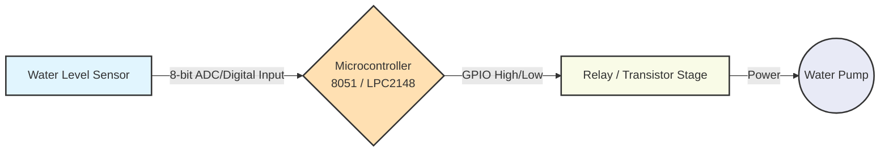
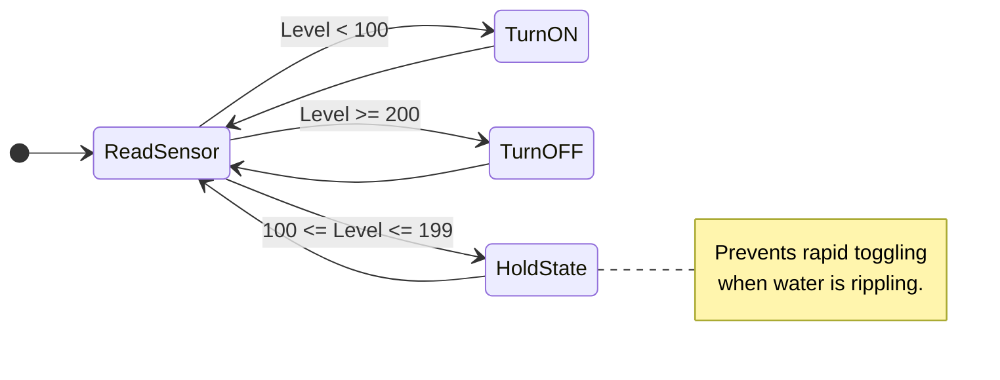

<div align="center">
  
# 🌊 Embedded Water Level Controller


*Smart, lightweight, and reliable water-level automation for microcontrollers written in **pure assembly**.*

</div>

<br />

## 📖 Overview

This repository provides two highly optimized, low-level implementations of a **hysteresis-based** water level control logic system. It continuously reads an 8-bit water-level input and manages a pump output using hysteresis threshold decisions. This ensures simple, reliable, and bounce-free tank automation.

Supported architectures:
- 🔵 **8051 Architecture** (`A51`)
- 🟢 **ARM7 LPC2148 Architecture** (`ARMASM`)

---

## 🏗️ System Architecture



## ⚡ Core Control Logic (Hysteresis)

To avoid rapid toggling (relay chatter) when the water ripples near the sensor, the controller evaluates the 8-bit input using a deadband (hysteresis) approach:

| Water Level | Decision | Pump State |
| :--- | :--- | :--- |
| **`< 100`** | Low level detected | 🟢 **TURN ON** |
| **`100..199`** | Mid-band / Deadband | 🟡 **HOLD previous state** |
| **`>= 200`** | High level detected | 🔴 **TURN OFF** |

### Logic Flow Diagram



---

## 💻 Implementations

### 1️⃣ 8051 Version
- **Source:** `src/8051/waterlevelcontroller.a51`
- **Startup:** `src/8051/STARTUP.A51`
- **Input:** `P1` (8-bit level reading)
- **Output:** `P2.0` (Pump control)

### 2️⃣ LPC2148 Version (ARM7)
- **Source:** `src/lpc2148/waterlevelcontrol.s`
- **Startup:** `src/lpc2148/Startup.s`
- **Input:** Lower 8 bits of `IO0PIN`
- **Output:** `P0.10` (Via `IO0SET` / `IO0CLR`)

---

## 📂 Repository Layout

```text
embedded-water-level-controller/
├── src/
│   ├── 8051/            # Assembly source (8051)
│   └── lpc2148/         # Assembly source (ARM7 LPC2148)
├── keil/
│   ├── 8051asm/         # Keil uVision project + build artifacts
│   ├── lpc2148asm/      # Keil ARM assembly project
│   └── lpc2148c/        # Keil C/AXF build outputs and reports
├── proteus/             # Proteus simulation project files
└── bin/                 # Prebuilt HEX binaries
```

---

## 🚀 Quick Start

### Option A: Use Prebuilt HEX
1. Navigate to the `bin/` directory.
2. Select your target binary (`8051asm.hex`, `lpc2148asm.hex`, or `lpc2148c.hex`).
3. Load it directly into your target development board or software simulator.
4. Map your input pins to the level sensor and the output pin to your relay driver.

### Option B: Build in Keil uVision
1. Open the respective `.uvproj` file located in the `keil/` directory.
2. Select your target device and verify toolchain settings.
3. Click **Build** to generate fresh artifacts.
4. Flash the generated output to your MCU.

---

## 🧪 Proteus Simulation

You can verify the logic safely using the provided `proteus/` files.

**Recommended Testing Flow:**
1. 📉 **Start below the low threshold (`< 100`)** ➔ Confirm pump activates.
2. 〰️ **Sweep through the mid-band (`100-199`)** ➔ Confirm pump state holds steady.
3. 📈 **Cross the high threshold (`>= 200`)** ➔ Confirm pump deactivates.
4. ⚡ **Introduce noisy signal transitions** around the boundaries to test hysteresis stability.

---

## ⚠️ Hardware & Safety Notes

- **Isolation is Key:** Never drive a pump directly from the MCU pins. Always use a relay or transistor stage (e.g., TIP120, ULN2003, or a standard relay module).
- **Flyback Protection:** Add a flyback diode across inductive loads (like the relay coil or motor) to protect the MCU from voltage spikes.
- **Signal Conditioning:** If your level sensor is prone to noise, consider adding hardware filtering (RC low-pass filter) before it hits the MCU.
- **Calibration:** The constants `100` and `200` are arbitrary defaults. Calibrate these thresholds in the code to match your specific ADC/sensor scale.

---

## 🎓 Educational Value

This repository serves as a practical learning resource for:
- Embedded systems labs and demonstrations.
- Mastering assembly language on both CISC (8051) and RISC (ARM7).
- Understanding deterministic control loops and GPIO fundamentals.
- Comparing low-level coding paradigms across different processor architectures.

---

## 🔮 Future Enhancements

- [ ] ADC-based analog sensing with software low-pass filtering.
- [ ] Configurable thresholds saved in EEPROM/non-volatile memory.
- [ ] Dry-run hardware protection and timeout safety logic.
- [ ] Visual/Audio alarm output (Buzzer, LED, or UART logging) for overflow scenarios.

---

## 👥 Contributors

This **Automated Water Level Monitoring and Control System** was developed by **Group 4**:

| Roll Number | Name | No. |
| :--- | :--- | :---: |
| **2023BCS0192** | RON STEPHEN MATHEW | 20 |
| **2023BCS0228** | BOGGU SIVA SAI | 21 |
| **2023BCS0159** | THOTA SAI KARTHIK | 22 |
| **2023BCS0036** | HARIPRASANTH M | 23 |
| **2023BCS0171** | RAGHAV KRISHNA M | 24 |
| **2023BCS0087** | JOSHI KSHITIJ SANTOSH | |

---
<div align="center">
  <i>Created with ❤️ for Embedded Development Learning.</i>
</div>
